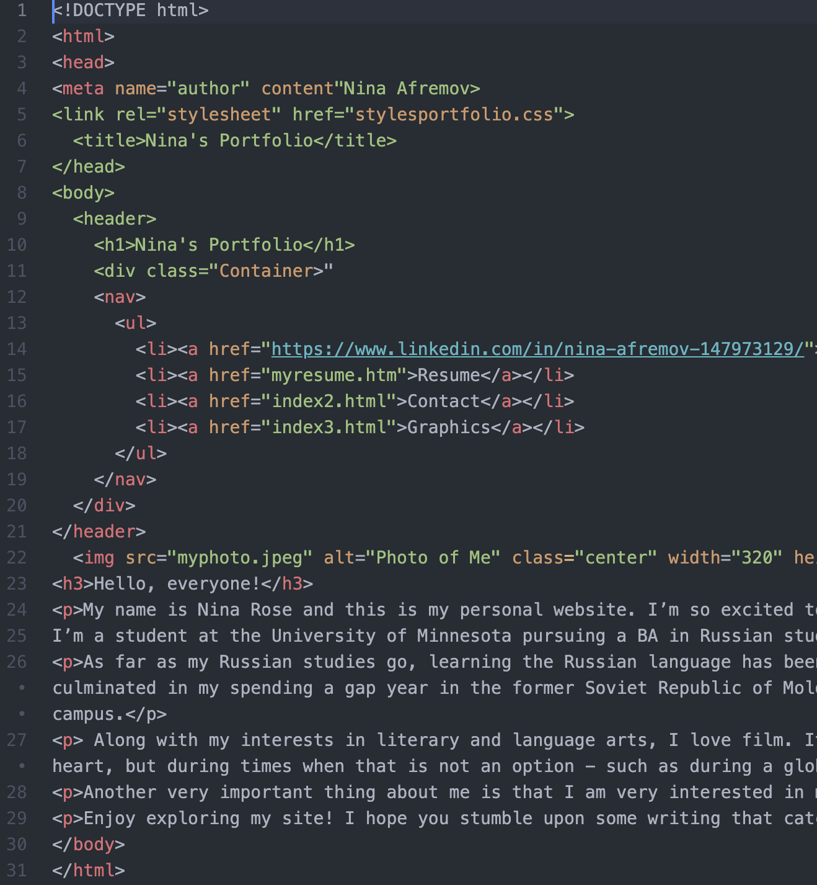
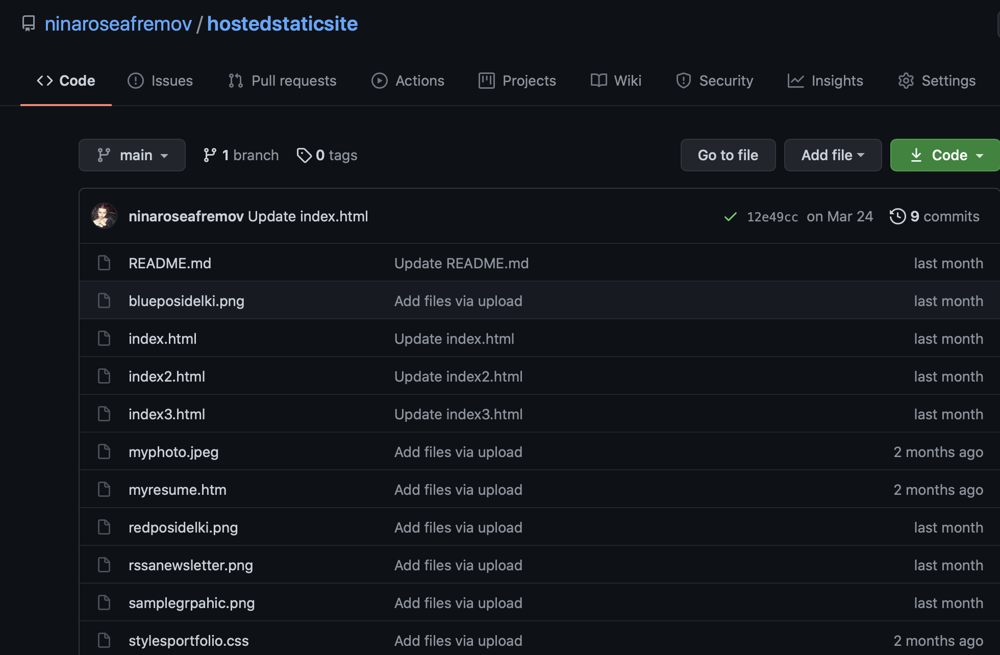

# Static Site

One of our very first assignments for this course was to create a static site. In order to do this, I had to learn the basics of html and css. I also learned how to publish my site using Github. This at first seemed very daunting. My digital literacy admittedly wasn't super advanced before this course and although I had experimented with html once in a browser, I didn't know where to start with this project.
However, using course resources, online tutorials, and advice from my friends, I managed to make something I felt good about.

Once I had atom downloaded and began the Linkedin html course, the rest seemed to fall together. I know feel confident with the very basics of html. Once I had all my html files finished, I then moved over to creating a css file. I found online forums to me the most useful in figuring out the basics of css.

As far as using Github, this was the easiest part of the project for me. Usually it takes me same repetition to pick up on new technical aspects, just like with learning a language, but uploading my files to a repository on Github went fairly smoothly.

I wish to revise my portfolio, or make a completely new one using the minimalist design of mkdocs, but here is a link to [my static website/portfolio](https://ninaroseafremov.github.io/hostedstaticsite/)
